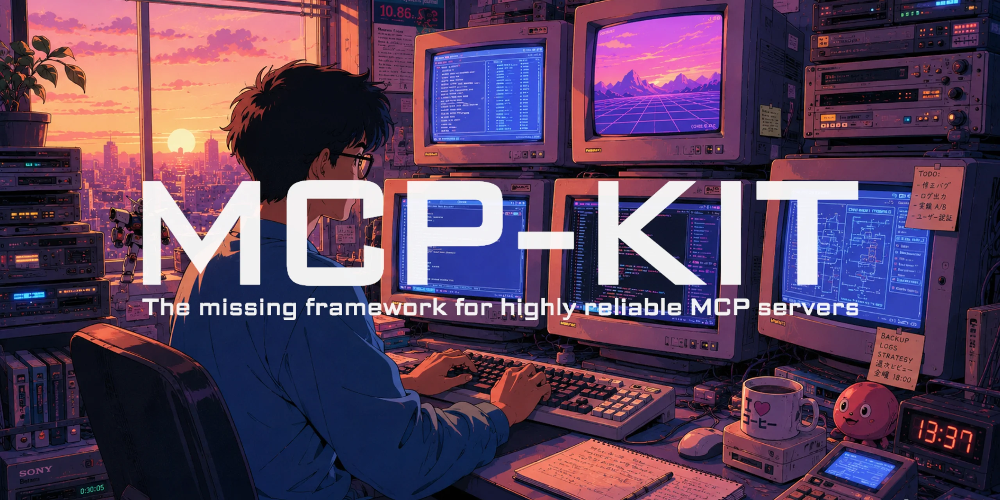

<div align="center">
  
  <h1 align="center">MCP-KIT</h1>

  <p align="center">
    The missing TypeScript/JavaScript framework and tooling for reliable production MCP
servers.
  </p>

  <p align="center">
    <a href="#requirements">Requirements</a>
    ·
    <a href="#development">Development</a>
    ·
    <a href="#release">Release</a>
  </p>
</div>

## Requirements

- Node.js 22.13+ or Node.js 24.x
- pnpm 11.5.2

## Development

```sh
corepack enable
pnpm install --frozen-lockfile
pnpm quality
```

## Release

The standard release and rollback procedure lives in [docs/release.md](./docs/release.md).
